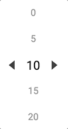

# number-picker


<br>



## Init

#### HTML

Element width needs to be provided for horizontal picker or height for vertical picker.

```
<div class="number-picker" style="width: 320px;"></div>
```

#### JS

```
var picker = new Picker({
    selector: ".number-picker",
});
```

## Settings

| Option            | Type    | Default           | Description                                 |
| -------------     | ------- | ------------------| ------------------------------------------- |
| selector          | string  | '.number-picker'  | Selects HTML element with a given selector. |
| orientation       | string  | 'horizontal'      | Accepts 'horizontal' or 'vertical'.<br>Setup position of a picker.|
| arrowOrientation  | string  | 'horizontal'      | Accepts 'horizontal' or 'vertical'.<br>Setup position of a picker navigation. |
| itemsToShow       | int     | 3                 | Number of a visible items.                  |
| start             | int     | 1                 | Start number.                               |
| end               | int     | 10                | End number.                                 |
| length            | int     | 10                | Number picker length.                       |
| step              | int     | 1                 | Number to increment every next item.        |
| activeIndex       | int     | 0                 | Set active number of a picker by its index. |


## Events

| Option        | Params        | Description                   | 
| ------------- | ------------- | ------------------------------|
| destroy       | -             | Destroy number-picker.        |
| getValue      | -             | Get current value.            |
| setValue      | value         | Set new value.                |
| prev          | -             | Go to previous item.          |
| next          | -             | Go to next item.              |
| afterChange   | currentValue  | After slide change callback.  |
| beforeChange  | currentValue  | Before slide change callback. |
